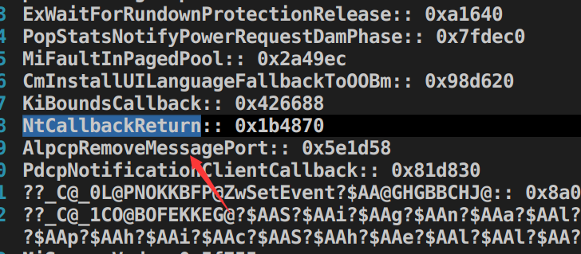
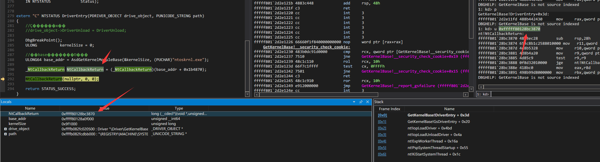

#### NT内核导出以及未导出函数-全局变量偏移速查

#### Quick check of NT kernel exported&unexported functions/global variable offset

###### System目录下有已经完成的偏移 可以在线速查

###### There are already completed offsets in the System directory, which can be quick checked online

###### https://github.com/DragonQuestHero/WindowsSyscallsEx/blob/master/System

<h1 align="center">
	
	 
	 
</h1>

#### 使用说明(Use:

###### 解压文件 2个DLL和exe以及nt pdb文件放置同一个目录 运行exe即可

###### Unzip the file ,2 DLLs one .exe and nt pdb files are placed in the same directory, just run the exe

###### 使用kernel base+偏移可以快速定位未导出函数 不必每个版本都用特征码搜索 也不必使用环3上传符号地址

###### Use kernel base+offset to quickly locate unexported functions. It is not necessary to search with signature codes for each version, and it is not necessary to use R3 to upload symbol addresses.

<h1 align="center">
	
	 
	 
</h1>

###### (详情:https://github.com/DragonQuestHero/WindowsSyscallsEx/blob/master/GetKernelBase/Main.cc#L290)

##### 部分情况下 因为系统小版本不同会出现偏移不一致的情况 所以尽量以小版本为准

##### In some cases, the offset will be inconsistent due to different minor versions of the system, so try to use the minor version as the standard.

##### 翻译来自https://github.com/finch7
